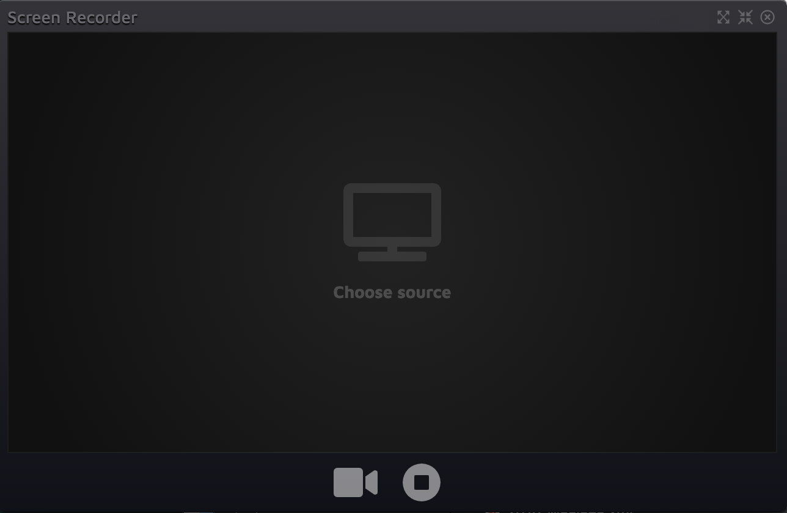

# Screen Recorder
This is a fairly simple Electron app that allows the user to record a video stream of any window on their system. This tool would be great way for you to capture anything from your screen and save it to a video.

Simply open the app, choose a window to record, press record, do that thing that you do, press stop, save the video.

### Requirements:
- [Node](https://nodejs.org/en/download/) version 10 or above must be installed
- [NVM](https://github.com/nvm-sh/nvm) is recommended (Node Version Manager)
- [Yarn](https://nodejs.org/en/download/)

### Set Up the Application
1. [Clone the repo](https://github.com/gotaloha/ScreenRecorder)
2. Open **Terminal** or equivalent
3. Navigate into the `ScreenRecorder` directory
4. Run the command: `npm install`
5. Run the command: `npm start`

### To Build the Application
1. Open **Terminal** or equivalent
2. Navigate into the `ScreenRecorder` directory
3. Run the command: `yarn make`
4. Find the compiled files in the `output` folder
   - The `make` folder contains the zipped package that you can distribute however you wish.
   - The other folder's name will vary depending on the system that you are using. An executable application file and it's package information can be found in this folder.

### Using the Application
1. **Click or tap** on the `Choose source` button in the center of the screen
2. **Choose** from the list of windows currently open on your computer or device.
    
    >Be patient - this may take a few moments if a lot of windows are open.
3. A **live video preview** will appear
   
   >Move the windows around if necessary to interact more easily and naturally.
   
   Ensure that your actions are visible in the preview window.
   
   There will be some lag. *Do not worry*, the recording will be smooth.
5. Notice the two buttons located at the bottom center of the app.
   - The video icon begins the recording
   - The stop icon ends the recording. You will then be prompted to save the file to your local computer or device.

